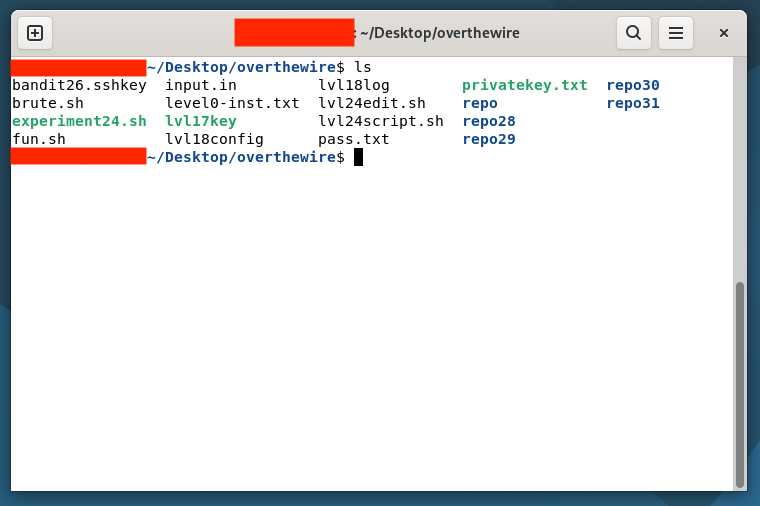

My experience finishing overthewire's Bandit levels (completed: January 12, 2026)

<!--more-->

Completing [overthewire](https://overthewire.org/wargames/)’s Bandit levels is possibly one of the fun ways to master important Unix/Linux commands. Solving the levels forces one to comprehensively read topics related to the problem at hand, and quickly learn from failing to crack the level. I would honestly recommend it for people who have some experience with Unix/Linux systems but want a fail-fast challenging refresher on the topic. This article serves as a catalog of helpful yet indirect hints that would direct the readers how to solve the problem (at least one way to do it) if they got lost.

>[!CAUTION]
>This series of problems was last solved in January 2026. Hints might be updated if in case the levels get updated in the near future, or even outdated if new levels are added.

# Level Arcs

- **Levels 0-3**: File reading
- **Levels 4-6**: File finding
- **Levels 7-9 & 17**: String search: searching the password within a file
- **Levels 10 & 11**: String translation, e.g. `base64`
- **Level 12**: Data (de)compression
- **Levels 13 & 18**: SSH, focusing on its features other than logging in with a password
- **Levels 14-16**: Basic network operations
- **Levels 19 & 20**: `setuid`
- **Levels 21-23**: `cron`
- **Level 24**: Brute forcing
- **Levels 25+26 & 32**: Shell escape
- **Levels 27-31**: git

Each level is grouped based on the common thematic point, which is composed of an arc. The levels are semi-ordered, since a theme might reappear on later levels, e.g. Level 32 being separate from other “shell escape” levels (level 25+26).

Usually in a given arc, the first level serves as a foundation for higher levels. I like to imagine it as a form of dialogue. Take the git arc as an example. Suppose that some developer, whose goal is hiding the password as best as they can from unauthorized agents, commits a simple yet fatal mistake in using git: leaving the password bare in a text file! We then respond by obtaining the exposed password. The developer, noticing the predicament they are in, attempts to amend their error as expressed in the next level (Level 28). We again respond by obtaining the password, and implicitly determine how the developer “fixed” the issue.

# Short commentaries

**Levels 0-3: File reading**

The difficulty of this arc increases as more “edge cases” are introduced. For example, what if the file name is `-` (which is an indicator that a command parameter is an option)? How do you read the contents of this file? What about a file name with spaces?

**Levels 4-6: File finding**

The primary gist of this arc is the usage of the `find` command. Take time to read its man page.

**Levels 7-9 & 17: String search**

Solutions in this arc mostly utilize the `grep` command. For some levels, the commands `sort`, `uniq`, and `diff` are crucial.

**Levels 10 & 11: String translation**

The use of the `base64` is given in level 10. What command enables us to **translate** characters?

**Level 12: Data (de)compression**

Which commands enable us to **compress (and decompress)** files? The `file` command is important to take note at this level. It is advised to create a temporary directory for this level (see `mkdir` manpage). The solution is repetitive, yet satisfying.

**Levels 13 & 18: SSH**

How does **SSH** utilize **public-key cryptography** in authentication? Is it possible to execute commands via SSH to a remote computer without the need to use the computer’s interactive shell?

**Levels 14-16: Basic network operations**

Focus on understanding the netcat (`nc`) command. Which command would enable us to perform **port scanning**?

**Levels 19 & 20: `setuid`**

The levels involve executing a binary file that uses the `setuid` system call. Level 20 serves as a good opportunity to learn the basics of `tmux` and **Unix job control**; either way is necessary in solving the level.

**Levels 21-23: `cron`**

The first two levels are relatively straightforward: simply read what the scripts being executed by `cron` does. Level 23 especially requires such comprehension skills, and asking under what conditions the script will execute. Level 23 took me longer than usual due to forgetting the simple fact that passwords are stored in `/etc/bandit_pass`.

**Level 24: Brute forcing**

This level is a good opportunity to practice shell scripting. Try referring to bash cheat sheets ( [here is an example](https://devhints.io/bash)) in solving the problem, or look at the shell (`sh`) manpage. Another hint: What does a command return after executing?

**Levels 25+26 & 32: Shell escape**

The most challenging yet my favorite arc in the Bandit game.

I have categorically combined levels 25 and 26 together because the solution in Level 26 is relatively straightforward and the level directly emerges after Level 25. Level 25+26 took me approximately three days to solve, yet yields a satisfying solution. Here are questions to consider that might be keys in solving Level 25+26:

1. Suppose that a user wants to access a remote shell (e.g. via SSH). How does the owner of that shell (most likely root) configure what shell this remote user will use?
2. How does the shell used in level 25 work? What’s the most crucial command that the shell uses, and how does this command work?
3. Can you spot any special commands in `vi` and `more` to escape the shell?

Level 32 surprisingly has a simpler solution than expected. Unlike Level 25+26, the shell used in this level is an executable binary, so we are forced to experiment with the shell like a black box. Here are key questions that might help you solve this level:

1. Maybe we can input something in the shell that does not involve alphabetic characters, since the inputs automatically convert to uppercase?
2. How is the shell in Level 32 initialized and executed?
3. In general, what variables do a shell script inherit when executed by a terminal?

**Levels 27-31: `git`**

Contrary to the shell escape arc, this is one of the easiest arcs to solve in my experience. It is in this arc that I have found out that **tags** exist as a git feature. I see some levels as examples of potential mishaps that a git user might do when using git, e.g. flawed attempts in removing leaked information with git.

# Tips

- **Patience is really the key.** Most of your time will be spent in reading man pages and searching online. Most solutions are not so obvious, since they often rely on unusual cases that are overlooked compared to how one usually utilizes the Unix/Linux(-related) OS.

- The basic fact that all of the passwords are stored in `/etc/bandit_pass` is key in solving multiple levels in Bandit levels. Another fundamental fact is that you can peek at the file contents of other levels (but not at the files themselves due to restricted file permissions), and even high level directories (e.g. `etc`).

- To solve higher levels, previously used commands will be useful, especially in levels that do not give explicit hints.

- Some solutions require you to check the contents of directories one-by-one, e.g. one of the git levels.

---

As proof of work, here's what's left of my local folder dedicated to solving all of the levels.

---

PS. I really ❤️ overthewire’s top menu image 🙂

